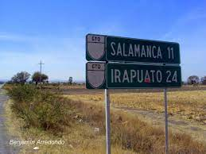

# OCR with Python
An easy way to detect words in an image with python and easy OCR.

1. Create virtual environment in a folder.
2. Execute next command: `pip install -r requirements.txt` to install all dependencies of project.
3. In `images` folder, put all images that you want to read with OCR.
4. Run code `testocr.py`.
5. Console will show all words or characters found.

## Example
We'll use this images:
1. 
2. 
3. 

When we'll run code, it'll give us next output:
```
Text in image: image2.jpg
        [INFO] Nube
        [INFO] de
        [INFO] Palabras
Text in image: image3.jpg
        [INFO] (salamanca M
        [INFO] IRAPUATO 24
Text in image: image4.jpg
        [INFO] STOP
```
